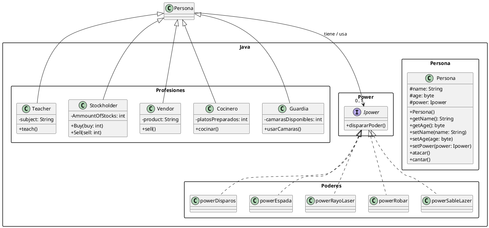

# Programacion orientada a objetos en Java

Ejemplo educativo de programacion orientada a objetos en Java. El programa crea
personas y profesionales, asigna poderes a cada persona y ejecuta el poder
asignado mediante una interfaz comun.

## Estructura

Las fuentes estan en `src/Java` y conservan la organizacion de paquetes del
proyecto:

- `Java.Persona.Persona`: clase base con nombre, edad y un poder opcional.
- `Java.Profesiones.Teacher`: persona que ensena una asignatura.
- `Java.Profesiones.Stockholder`: persona que compra y vende acciones.
- `Java.Profesiones.Vendor`: persona que vende un producto.
- `Java.Profesiones.Cocinero`: persona que cocina y cuenta platos preparados.
- `Java.Profesiones.Guardia`: persona que usa camaras para detectar peligros.
- `Java.Power.Ipower`: interfaz que define `dispararPoder()`.
- `Java.Poderes.*`: implementaciones de poderes: disparos, espada, rayo laser,
	robar y sable lazer.
- `quickstart`: punto de entrada; crea objetos, asigna poderes y los hace atacar.

## Compilar y ejecutar

Desde la raiz del repositorio:

```bash
javac  Java/*/*.java
java Java/quickstart.java
```

La seleccion de profesiones y poderes del ejemplo usa valores aleatorios, por
lo que cada ejecucion puede mostrar una combinacion diferente.

## Diagrama de clases

El siguiente diagrama PlantUML muestra los paquetes, la herencia, las
implementaciones de `Ipower` y la asociacion entre `Persona` y su poder.


